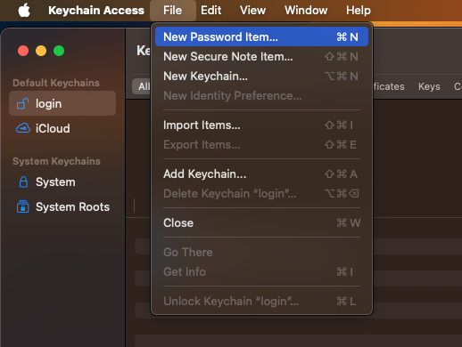
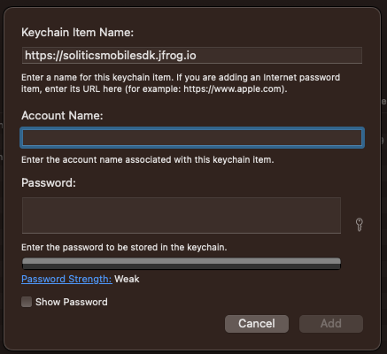
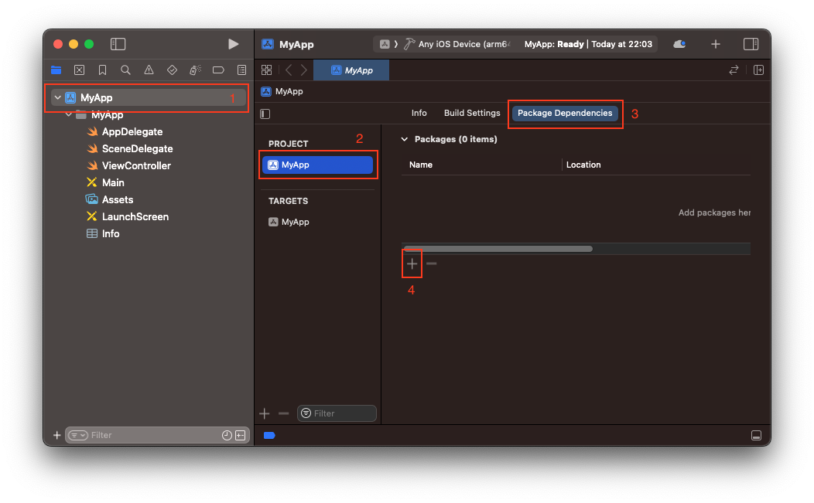
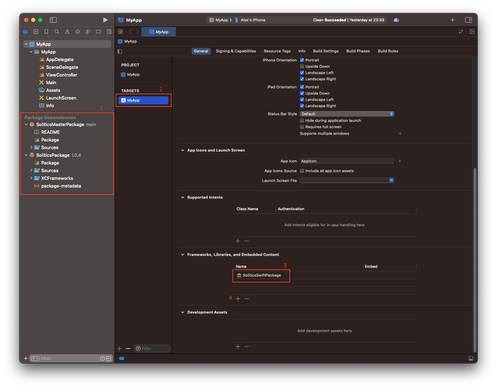
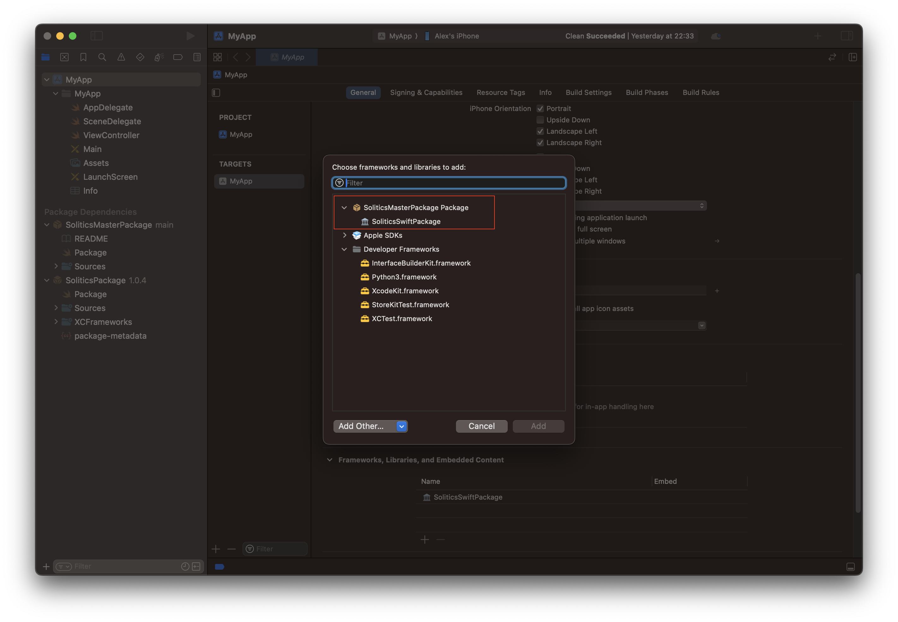
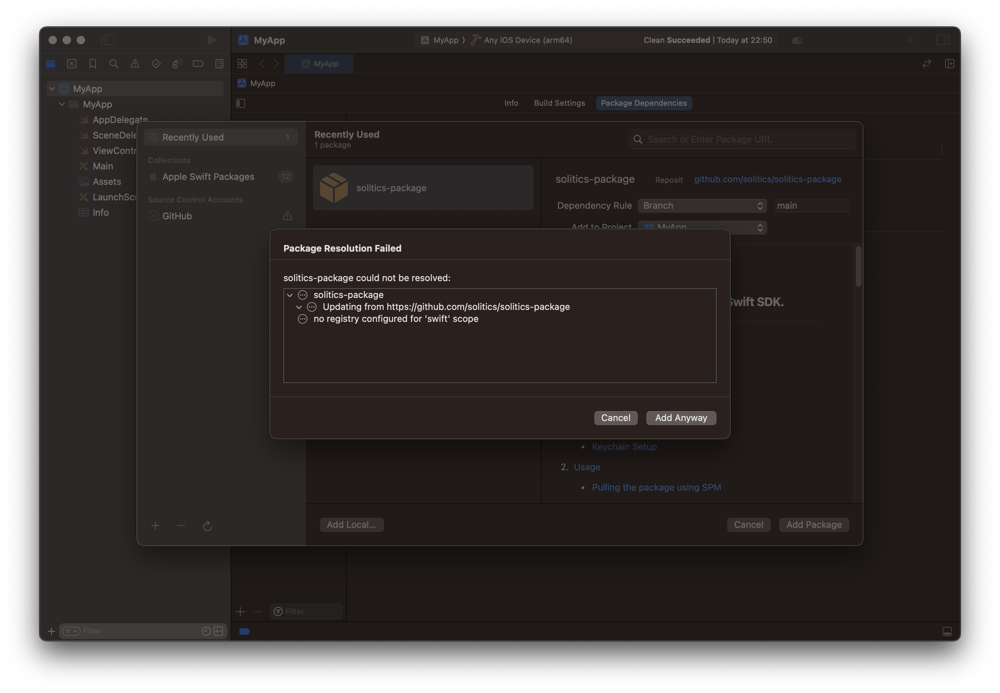

# Solitics-Packge
### A Wrapper Package for Solitics Swift SDK.
_____
## Overview

SoliticsSDK relies on JFrog Artifactory to host its framework. The registry, in this case,
is private and can only be accessed through JFrog authentication. To integrate SoliticsSDK seamlessly,
setting the registry for Swift Package Manager becomes essential. This readme will guide you in the process of
gaining access to it.

## Table of Contents

1. [JFrog Configuration](#jfrog-configuration)
    - [Keychain Authentication](#keychain-authentication)
    - [Set Registry](#set-registry)

2. [Usage](#usage)
    - [Pulling the Package using SPM](#pulling-the-package-using-spm)

3. [Support](#support)
    - [Troubleshoot](#troubleshoot)
    - [Contact Us](#contact-us) 
____

## JFrog Configuration

* ### Initial
For the authentication to work properly, make sure you first follow the setup process as described in the JFrog "set me up" panel.

* ### Keychain Authentication

**Please note: This step is no longer needed as the security policy has changed.**

For authentication with the private JFrog Swift Registry, you need to set up an internet password in your keychain. Follow these steps:

1. Open Keychain Access on your macOS.
2. Click on File > New Password Item.
   <br></br>
   
   <br></br>
3. Enter the following details:
   * Name: https://soliticsmobilesdk.jfrog.io
   * Account Name: [Your Email]
   * Password: [Your Token] << you get this from the JFrog "set me up" panel
   <br></br>
   
   <br></br>
Add the password, and the SPM will use it for authentication with JFrog.

* ### Set Registry
Swift Package Manager points to a default registry. In the following steps, 
we will point the registry to Solitics Artifactory instead.

A few side notes to consider before proceeding:
* You can either set the registry **per Xcode project,** meaning only that project will have access
  to the registry, while others won't. **Or globally,** meaning every project will have access to it. Either way,
  there is a fallback that should point back to the default registry when a package is not found.
* Changing the registry requires a `Package.swift` file and can be deleted after the registry has been set.

1. Open Terminal.
2. Navigate to your project directory.

```bash
cd ~/MyAppDirectory/
```
3. Create a dummy 'Package.swift' file (if non-existent).

```bash
touch ./Package.swift
```

4. Use the following command to set the registry.

```bash
swift package-registry set "https://soliticsmobilesdk.jfrog.io/artifactory/api/swift/solitics-mobile-spm-swift"
```


* If you want to add the registry for every project, add the `--global` flag.

```bash
swift package-registry set "https://soliticsmobilesdk.jfrog.io/artifactory/api/swift/solitics-mobile-spm-swift" --global
```
If you want to double-check the command succeeded, run the following command.

```bash
vi ./.swiftpm/configuration/registries.json
```
or if used the `--global` flag

```bash
vi ~/.swiftpm/configuration/registries.json
```
You should see the following content:

```json
{
  "authentication" : {

  },
  "registries" : {
    "[default]" : {
      "supportsAvailability" : false,
      "url" : "https://soliticsmobilesdk.jfrog.io/artifactory/api/swift/solitics-mobile-spm-swift"
    }
  },
  "version" : 1
}
```
To exit enter `:qa!`

5. This step only applies if you created a dummy `Package.swift`.

```bash
rm -rf Package.swift
```
____


### Usage

* #### Pulling the Package using SPM

To add a .git repository to your Xcode project, follow these steps:

1. Open Xcode and navigate to your project.
2. Select your project in the Project Navigator.
3. Click on "Swift Packages" tab.
4. Click on the "+" button to add a new package.
5. Enter the repository URL: `https://github.com/solitics/solitics-package`.
   <br></br>
   
   <br></br>
6. Choose a 'Dependency Rule' and select your target if not selected.
7. Click 'Add Package.'
    <br></br>
    
     <br></br>
8. Xcode will ask you to enter the password for the keychain we added above, once granted Xcode will fetch the repository and add it to your project.
9. You should now see the Solitics Package on the left side bar, navigate to your project target and make
sure the `SoliticsWrapper` is present in `Frameworks, Libraries, and Embedded Content`.
   

10. If it's not present, click the `+` button and add from the menu.


____


## Support

* ### Troubleshoot
When trying to add the Solitics .git repository:
1. After setting the Keychain password, Xcode does not ask you to authenticate the JFrog registry; this means
you did not configure the password correctly and should try the steps again. [Keychain Authentication](#keychain-authentication)
2. When adding the Swift package, you are prompted with an error 'no registry configured for 'swift' scope.'
   
    Either Xcode holds an old registry cache, and we need to force update it, or you didn't add the registry correctly.

First, let's try to force update the registry:
   1. Clean your derived data folder and build folder.
   2. Close Xcode completely and reopen it.
   
Another possibility is that you need to log in to the registered registry.
Use the following command for this:

```bash
swift package-registry login "https://soliticsmobilesdk.jfrog.io/artifactory/api/swift/solitics-mobile-spm-swift" --token "<insert-your-artifactory-token-here>" --username "<insert-your-artifactory-user-name-here>"
```
You can check that the system logged in successfully by looking into the `.swiftpm/configuration/registries.json` file again.

You should see the following content:
```json
{
  "authentication" : {
    "soliticsmobilesdk.jfrog.io" : {
      "loginAPIPath" : "/artifactory/api/swift/solitics-mobile-spm-swift",
      "type" : "basic"
    }
  },
  "registries" : {
    "[default]" : {
      "supportsAvailability" : false,
      "url" : "https://soliticsmobilesdk.jfrog.io/artifactory/api/swift/solitics-mobile-spm-swift"
    }
  },
  "version" : 1
}
```

If this does not help, try re-adding the registry. [Set Registry](#set-registry)
